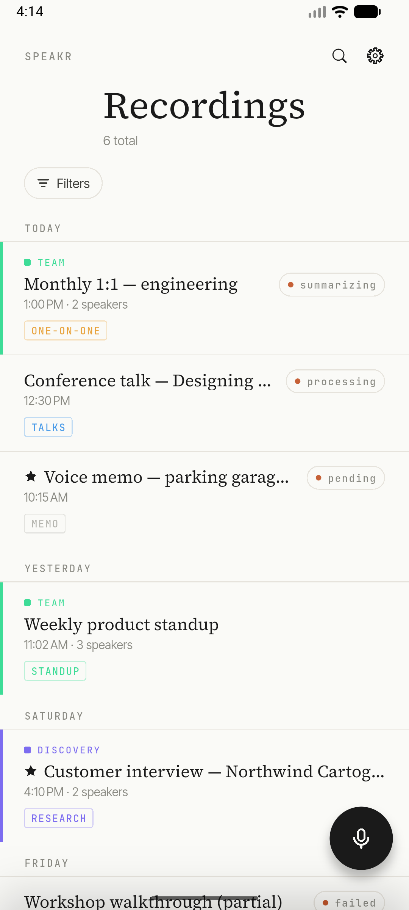
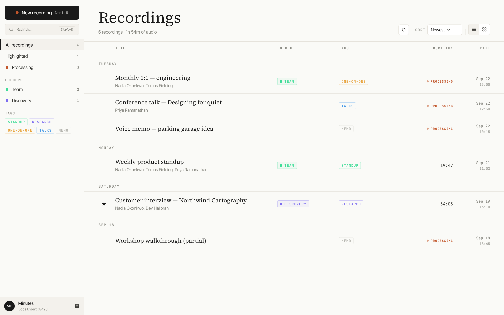
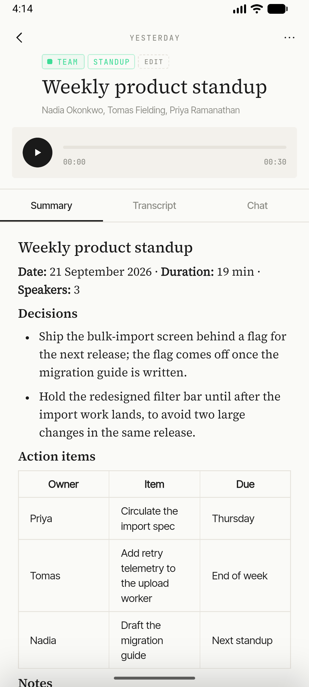
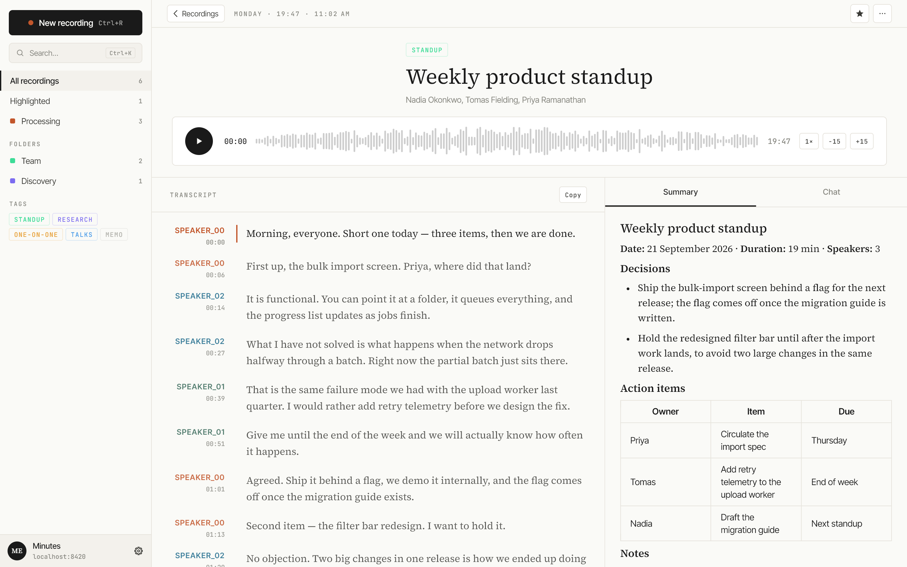
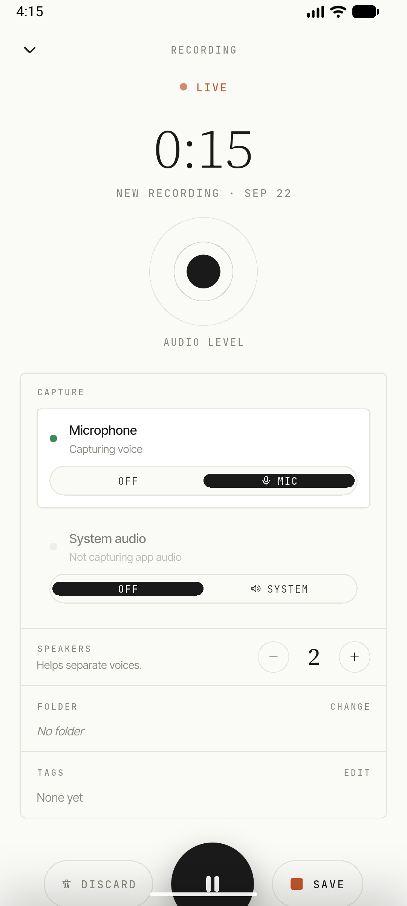
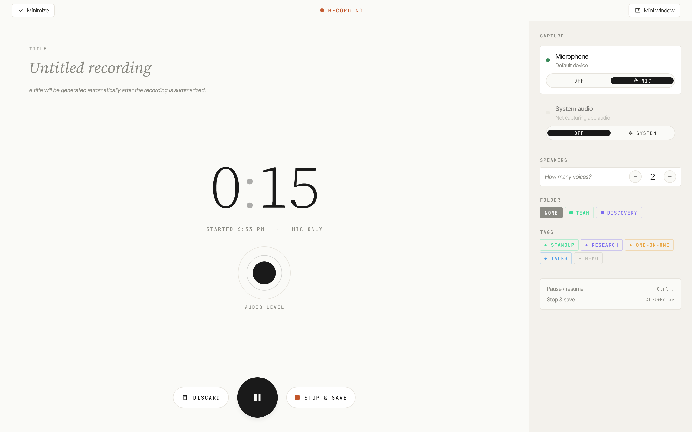
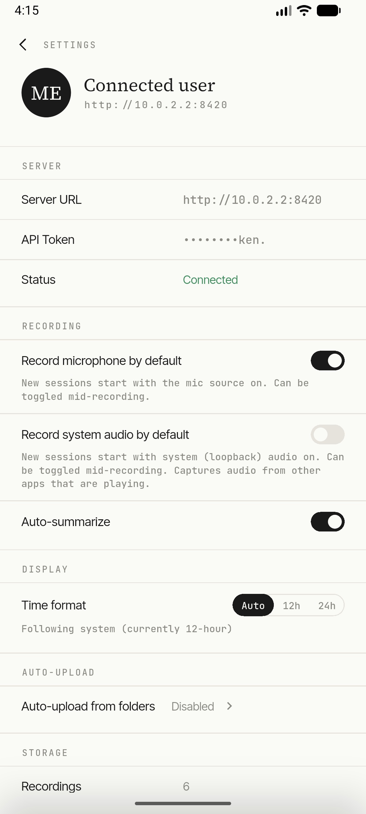
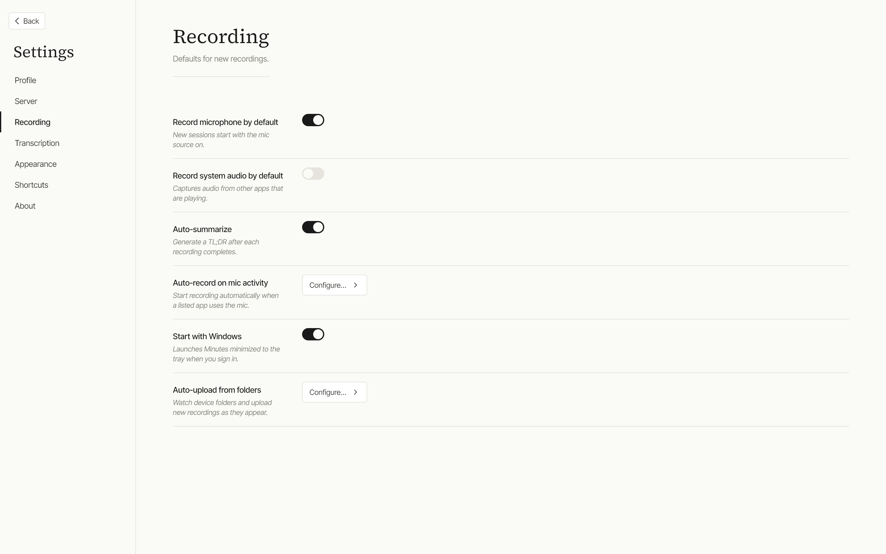
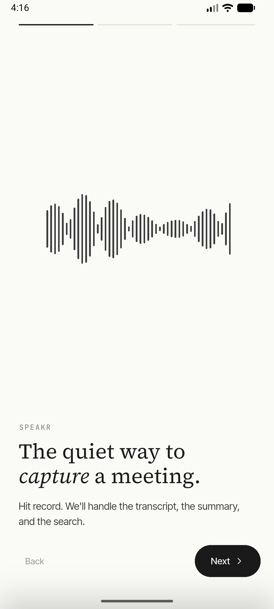
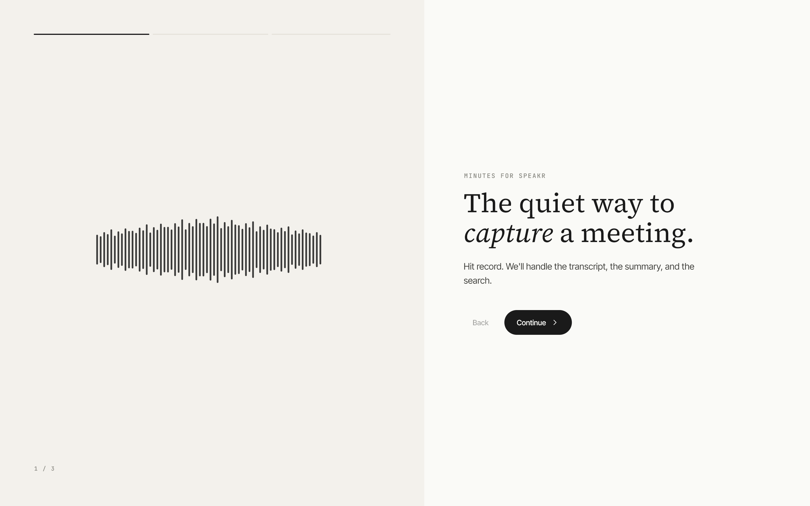

# Screenshots

All screenshots are captured from the real app against the invented dataset in
[`tools/mock-server`](../../tools/mock-server/README.md), so there's no real data in them.
The project [`README.md`](../../README.md) shows one per platform (the recordings list);
the full set is below.

| Screen | Android | Windows |
| --- | --- | --- |
| Recordings list |  |  |
| Recording detail |  |  |
| Live capture |  |  |
| Settings |  |  |
| Onboarding |  |  |

## Notes

- Android shots are the Google Play listing screenshots: 1080 × 2400, Medium Phone API 36.1
  AVD, profile build. See [`../play-store/checklist.md`](../play-store/checklist.md).
- Windows shots are 2880 × 1800: a 1440 × 900 window at 2× pixel ratio, captured from a
  debug build via a throwaway `integration_test` harness.
- `mobile.png` duplicates `mobile-detail.png`. It's kept only because the Play docs refer to it;
  don't upload it to the Play Console.
